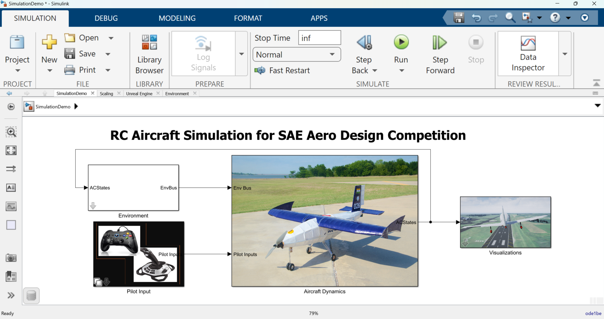
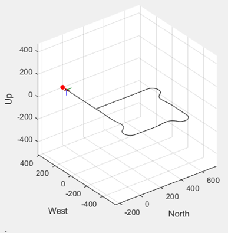

# Virtual Environment for SAE Aero Design®

## Overview

This repository contains a **MATLAB® Project** and associated files for a **virtual aircraft simulation environment** developed to support [**SAE Aero Design®**](https://www.saeaerodesign.com/) student teams. **SAE Aero Design®** is an annual aircraft design, build, and fly competition organized by [**SAE International®**](https://www.sae.org/).   

This project enables student teams to define, import, and simulate their **radio‑controlled (RC) aircraft**, including:

- Aircraft geometry  
- Mass and inertia properties  
- Aerodynamic characteristics  
- Propulsion system data  

The virtual environment allows teams to test aircraft performance and evaluate mission scores across **seven predefined virtual environment conditions** aligned with competition objectives.

| Simulink model | Visualization |
| :------------: | :-----------------: |
|  |  |

---

## Key Features

- Support for multiple aerodynamic modeling approaches  
- Evaluation of aircraft performance across multiple environments  
- **Pilot‑in‑the‑Loop (PIL)** simulation capability  
- Compatible pilot input devices:
  - RC Controller  
  - Joystick  
  - Flying stick  
- Real‑time 3D visualization using:
  - Simulink® 3D Animation™
  - Unreal Engine–based virtual environments  
- Automatic logging of simulation data to the MATLAB workspace for post‑processing

---

## Getting Started

Follow the steps below to run the simulation environment.

### Step 1: Download and Open the Project

1. Download or clone this repository to your local machine.
2. Extract the contents if downloaded as a ZIP file.
3. Open MATLAB®.
4. Navigate to the local project folder.
5. Open the MATLAB Project: RC_Demo.prj

---

### Step 2: Configure Aerodynamic Data

From the **Project Shortcuts**, open **one** of the following live scripts:

- **Excel template based data setup**  
Use this option if the aerodynamic data is obtained using experimental methods with aerodynamic analysis software packages.  

- **DIGITAL DATCOM import based data setup**  
Use this option if the aerodynamic data is generated using **DIGITAL DATCOM**.

Populate all required data fields as described in the selected live script.
⚠️ Ensure that units and reference axes are consistent across all inputs.

---

### Step 3: Calibrate and test your Pilot Input Device

1. Connect your pilot input device (RC controller, joystick, or flying stick).From the Project Shortcuts, open shortcut **2a. Calibrate Pilot Input Device**.
2. Open Pilot Input Device subsystem and calibrate the device for the actuator deflections. Export the calibration parametrs and save the model.  
3. Now open **2b. Test  Calibrated Output** from the project menu and load the calibration configuration file and test the actuator deflections. 
4. Run the simulations and check actuator deflections output. If actuator deflections are appropriate as per the calibration, then move to next step else repeat the proceess. 

---

### Step 4: Launch the Simulation

- Click the **3. Launch simulation environment** shortcut.
- The Simulink® aircraft model will open automatically.

---

### Step 5: Select Environment and Visualization

- Load the calibration file in the ** Calibrated Pilot Input " subsytem. 
- Choose the virtual environment in the **Environment** subsystem in which you want to test your aircraft.
- Select the desired visualization method in the **Visualization** subsystem.

---

### Step 6: Run the Simulation

1. Click **Run** in Simulink®.
2. Fly the aircraft using the selected pilot input device.
3. At the end of the simulation:
- All simulation data is saved automatically in the MATLAB workspace.
- The data can be used for further analysis and validation.

---

## Requirements

The following MathWorks® products are required:

- MATLAB® 2025a or later  
- Simulink®  
- Aerospace Blockset™  
- Aerospace Toolbox™  
- UAV Toolbox™  
- Simulink® 3D Animation™  

---

## License

License information is available in the [`LICENSE.txt`](./license.txt) file included in this repository.

---

## Community Support

- For any queries, feel free to reach out to us at [roboticsarena@mathworks.com](mailto:roboticsarena@mathworks.com).

---

## Copyright and Trademarks

© 2026 **The MathWorks, Inc.** All rights reserved.

MATLAB and Simulink are registered trademarks of The MathWorks, Inc. See www.mathworks.com/trademarks for a list of additional trademarks. Other product or brand names may be trademarks or registered trademarks of their respective holders
