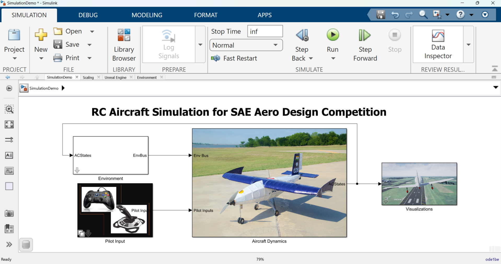
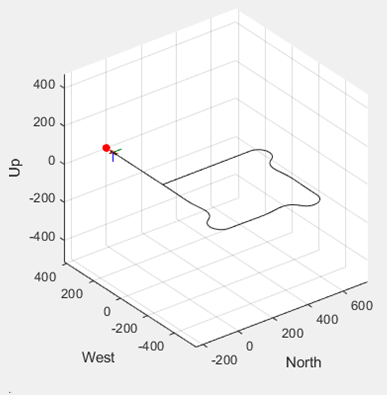

# Virtual Environment for SAE Aero Design

<!--   --> 

 

## Overview

This MATLAB and Simulink project provides a pilot-in-the-loop, six-degree-of-freedom aircraft simulation for SAE Aero Design teams. It combines aircraft geometry, mass and inertia, aerodynamic coefficients, propulsion data, environment physics, visualization, and simulation logging.

Teams can fly against eight predefined operating environments or define a complete custom environment for a local airfield, expected competition weather, or a targeted wind, turbulence, and gust case.

| Simulink model | Visualization |
| :------------: | :-----------: |
|  |  |

## Key Features

- Excel-template and DIGITAL DATCOM aerodynamic-data workflows
- Calibrated RC controller, joystick, and flying-stick input
- A masked Environment Variant Subsystem with custom and preset sources
- Eight versioned presets stored in `Core/environment/environmentData.sldd`
- Custom location, atmosphere, wind shear, Dryden turbulence, and discrete gust parameters
- Temperature-adjusted atmospheric density using the selected ISA temperature deviation
- Simulink 3D Animation and Unreal Engine visualization options
- Automatic flight-parameter scopes and simulation logging
- Aircraft-design validation for supported SAE Aero Design Regular Class rules

## Getting Started

1. Open MATLAB R2025b or later.
2. Navigate to the repository root.
3. Open `RC_Demo.prj`.
4. Use the project shortcuts in order.

### 1. Configure Aircraft Data

Open one of these project shortcuts:

- **(1a) Excel template-based setup** for manually prepared or experimentally derived aircraft data.
- **(1b) DIGITAL DATCOM import** for DIGITAL DATCOM aerodynamic coefficients and Excel propulsion data.

Keep units, reference axes, and sign conventions consistent across all inputs.

### 2. Calibrate the Pilot Input Device

1. Connect the pilot input device.
2. Open **(2a) Calibrate Pilot Input Device**.
3. Map the channels, verify actuator directions and limits, export the calibration configuration, and save the model.
4. Open **(2b) Test Calibrated Output**, load the configuration, and confirm every actuator response.

### 3. Launch the Simulation

Open **(3) Launch Simulation Environment**, then configure:

- **Calibrated Pilot Input:** load the tested controller calibration.
- **Environment:** select `Custom environment` or one of the eight predefined environments.
- **Visualization:** choose the visualizer and enable **Plot Flight Parameters** when the Position and Attitude and Velocities, Rates and Controls scopes are required.

The scopes open automatically when **Plot Flight Parameters** is enabled and close when it is disabled.

## Environment Selection

`Custom environment` is the first Environment-mask option. Selecting it reveals all custom fields; selecting a preset hides those fields and reads the released values from `environmentData.sldd`. Switching modes does not overwrite custom entries.

Custom mode provides:

| Group | Parameters |
| --- | --- |
| General | Environment name, description, score multiplier, competition-site flag |
| Location | Location name, city, country or region, latitude, longitude, MSL elevation |
| Atmosphere | Reference elevation, ISA temperature deviation, temperature, pressure, density |
| Wind shear | Speed at 6 m, meteorological direction, power-law exponent |
| Turbulence | Enable state, speed, direction, intensity, scale length, repeatable noise seeds |
| Gust | U/V/W enables, amplitudes, lengths, start time, start altitude AGL |

Wind directions use the meteorological convention: degrees clockwise from north and indicating the direction the wind comes from. The body-axis gust amplitudes model headwind or tailwind (`U`), crosswind (`V`), and vertical gust (`W`) effects.

Both environment choices feed the same gravity, atmosphere, temperature-adjusted density, wind shear, turbulence, and gust physics.

## Run and Review

Run the model from Simulink and fly with the calibrated input device. Results are written to the `out` variable in the MATLAB workspace and are available in Simulation Data Inspector for comparison and analysis.

## Requirements

- MATLAB R2025b or later
- Simulink
- Aerospace Blockset
- Aerospace Toolbox
- UAV Toolbox
- Simulink 3D Animation

## License

See [`license.txt`](./license.txt).

## Support

Send questions, bug reports, and feature requests to [roboticsarena@mathworks.com](mailto:roboticsarena@mathworks.com).

Copyright 2026 The MathWorks, Inc.
